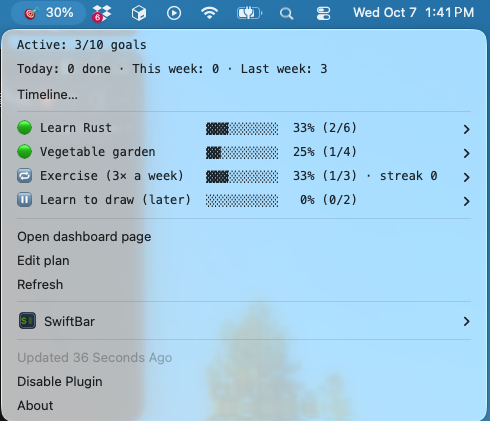
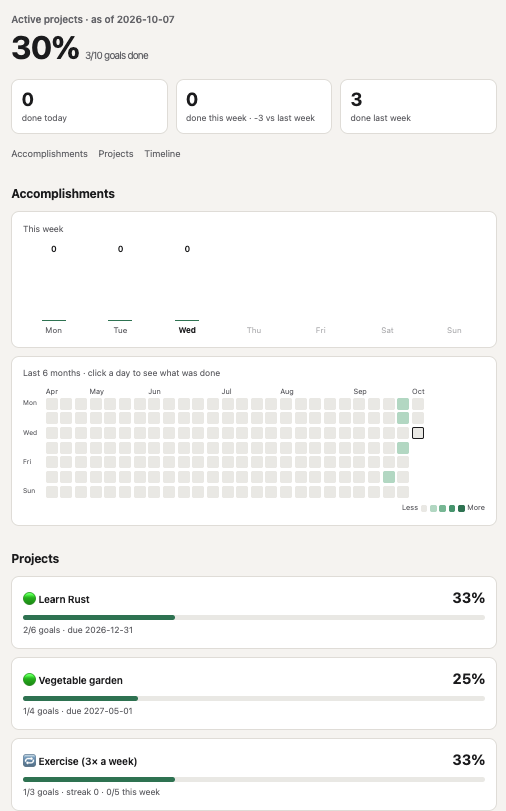
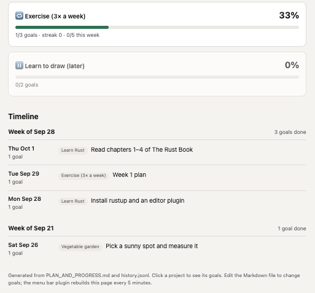

# TaskDashboard

Shows your personal projects, their goals and **% completion**, read straight from a plain
Markdown file, `PLAN_AND_PROGRESS.md` (start from
[the example](examples/PLAN_AND_PROGRESS.example.md)):

- **Menu bar / tray icon** on macOS, Ubuntu and Windows: the overall %, and a menu with each project's % and its goals
- **Web page**: `index.html`, a single file you can double-click. Click a project to expand its goals
- **Accomplishments**: what you finished today and this week, a 6-month activity grid and a timeline, from `history.jsonl`

Built from the [example plan](#try-the-example):

| Menu bar (macOS) | Web page: overview and projects | Web page: timeline |
|---|---|---|
|  |  |  |

Your personal files (the plan, `history.jsonl` and the generated `index.html`) live in
`data/` by default, which git ignores, or in any folder you choose: see
[Where your files live](#where-your-files-live).

No database: the Markdown file is the source of truth. Edit it in any editor (or with
the commands below) and the dashboard follows. Standard library only, so nothing to install.

---

## Install

### 1. Download

Open the [**latest release**](../../releases/latest) and download the package for your system:

| System | Download | Needs |
|---|---|---|
| macOS | `taskdashboard-<version>-macos.zip` | [SwiftBar](https://github.com/swiftbar/SwiftBar): `brew install --cask swiftbar` |
| Ubuntu | `taskdashboard-<version>-linux.tar.gz` | `sudo apt install python3-gi gir1.2-ayatanaappindicator3-0.1` (often already there) |
| Windows | `taskdashboard-<version>-windows.zip` | Python 3: `winget install Python.Python.3.13` |

Optional: check the download against `SHA256SUMS.txt` from the same release, with
`shasum -a 256 <file>` (macOS), `sha256sum <file>` (Ubuntu) or `Get-FileHash <file>` (Windows).

### 2. Unzip and run the installer

Unzip it somewhere permanent, such as `~/Applications` or `Documents`: the icon runs from that
folder. Then, in a terminal in the unzipped folder:

```bash
bash macos/install.sh --data ~/Documents/TaskDashboard      # macOS
bash linux/install.sh --data ~/Documents/TaskDashboard      # Ubuntu
```
```powershell
powershell -ExecutionPolicy Bypass -File windows\install.ps1 -Data "$HOME\Documents\TaskDashboard"
```

The installer creates `PLAN_AND_PROGRESS.md` in that folder from an example plan, puts the icon
in the menu bar / top bar / notification area, and starts it at every login. Use **Edit plan**
in its menu to replace the example with your own projects. `INSTALL.txt` in the package has the
same steps.

`--data` keeps your plan and history outside the unzipped folder, so updating never touches
them. Without it they go in `data/` inside the unzipped folder. You can move them later with
`./td config --data DIR --move` (see [Where your files live](#where-your-files-live)).

### Update to a new version

Download and unzip the new release, run its installer **without** `--data` (your folder is
remembered in the config file), then delete the old unzipped folder.

### Uninstall

Run the installer with `--remove` (`-Remove` on Windows), then delete the unzipped folder.
Your data folder and the config file are left alone; delete them too if you don't need them.

### From source instead

```bash
git clone <this repository's URL> TaskDashboard
cd TaskDashboard
```

Then use the installers above from the clone, or just the command line in [Quick start](#quick-start).
`git pull` updates it.

## Quick start

```bash
cd TaskDashboard
./td build --open    # writes data/index.html and opens it
```

Windows (PowerShell or Command Prompt): `.\td build --open`

`td` is a shortcut for `PYTHONPATH=src python3 -m taskdashboard`. There are two versions of it,
one per operating system, and you type `td` on both:

| File | For | Run it as |
|---|---|---|
| `td` | macOS and Linux (a shell script, no extension, like most commands there) | `./td …` |
| `td.cmd` | Windows (a batch file; Windows needs the `.cmd` to run it, but finds it without typing it) | `.\td …` |

Optional: `pip install -e .` gives you a `taskdashboard` command instead, on any system.

## Try the example

`examples/` has a sample plan and a matching `history.example.jsonl`, so you can see the page,
with its activity grid and timeline, before writing your own plan. Copy both to a scratch
folder and build there; your own data and the example files are never touched:

```bash
mkdir -p /tmp/td-demo
cp examples/PLAN_AND_PROGRESS.example.md /tmp/td-demo/PLAN_AND_PROGRESS.md
cp examples/history.example.jsonl /tmp/td-demo/history.jsonl
./td --plan /tmp/td-demo/PLAN_AND_PROGRESS.md build --open
```
```powershell
mkdir "$env:TEMP\td-demo"
copy examples\PLAN_AND_PROGRESS.example.md "$env:TEMP\td-demo\PLAN_AND_PROGRESS.md"
copy examples\history.example.jsonl "$env:TEMP\td-demo\history.jsonl"
.\td --plan "$env:TEMP\td-demo\PLAN_AND_PROGRESS.md" build --open
```

`--plan` goes before the command, and `history.jsonl` and `index.html` are read and written
next to that plan. The example's ticks are dated 26 September to 1 October 2026: they show in
the activity grid and timeline, while "today" and "this week" stay empty unless you tick
something in the demo plan.

## Where your files live

Your plan, `history.jsonl` and `index.html` live together, in `data/` by default.
`history.jsonl` and `index.html` always sit **next to the plan**, so moving the plan takes them
along. To keep them somewhere else (outside the code, so updating TaskDashboard never touches
them), use the `td` shortcut in this folder (`td` on Windows):

```bash
./td config                                              # show where every file is, and why
./td config --data ~/Documents/TaskDashboard --move      # move plan + history to that folder
./td config --plan ~/Dropbox/goals.md --move             # or to a plan file with another name
./td config --data ~/Documents/TaskDashboard             # just point there (then ./td init for a new plan)
```

`--move` copies your plan and `history.jsonl`, checks the copies, updates the config file, and
only then deletes the originals (`index.html` is rebuilt). It never overwrites a file that is
already there, and stops if a `TASKDASHBOARD_*` variable would keep pointing at the old place.

The installers do the same with `--data DIR` (`-Data DIR` on Windows). The folder is saved in a
small config file:

| System | Config file |
|---|---|
| macOS | `~/.config/taskdashboard/config.ini` |
| Ubuntu | `~/.config/taskdashboard/config.ini` (or under `$XDG_CONFIG_HOME`) |
| Windows | `%APPDATA%\taskdashboard\config.ini` |

```ini
[taskdashboard]
data = ~/Documents/TaskDashboard
# plan = ~/Dropbox/goals.md    (a plan file with another name; history goes beside it)
# history = ... / html = ...   (only to put those somewhere other than next to the plan)
```

Each path is taken from the first of these that is set:

1. `--plan` on the command line (one command only; history and page go next to that plan)
2. Environment variables: `TASKDASHBOARD_DATA`, or `TASKDASHBOARD_PLAN` / `_HISTORY` / `_HTML`
3. The config file
4. `data/` in this folder

Use the config file rather than an environment variable for the icon: the menu bar, top bar and
tray icons are started by the desktop, not your shell, so they never see variables set in
`~/.zshrc` or `~/.bashrc`.

## Icon at the top (or bottom) of the screen

| System | Where | What it shows | Folder |
|---|---|---|---|
| macOS | menu bar, top right | `🎯 13%` | `macos/` |
| Ubuntu | top bar, top right | target icon + `13%` | `linux/` |
| Windows | notification area, bottom right | the number drawn in the icon, details on hover | `windows/` |

All three refresh every 5 minutes, record new ticks in `history.jsonl` and rebuild `index.html`.

### macOS (SwiftBar)

Uses [SwiftBar](https://github.com/swiftbar/SwiftBar), which turns a script's output into a menu bar item.

```bash
brew install --cask swiftbar
macos/install.sh                                  # link the plugin into SwiftBar's plugin folder and start it
macos/install.sh --data ~/Documents/TaskDashboard # same, keeping your data in that folder
macos/install.sh --remove                         # undo (your data is left alone)
```

Run `macos/install.sh` again if you move the repo; it repairs the link.

The plugin refreshes every 5 minutes (`.5m.` in its name) and **rebuilds `index.html` each time**,
so the page stays up to date. Use *Refresh* in the dropdown to update immediately.

### Ubuntu

Uses AppIndicator, which Ubuntu's built-in *Ubuntu AppIndicators* extension shows in the top bar.

```bash
sudo apt install python3-gi gir1.2-ayatanaappindicator3-0.1   # often already installed
python3 linux/taskdashboard_indicator.py                        # try it (Ctrl+C to stop)
linux/install.sh                                                # start at every login, and now
linux/install.sh --data ~/Documents/TaskDashboard               # same, keeping your data in that folder
linux/install.sh --remove                                       # undo (your data is left alone)
```

Not showing? Check that *Ubuntu AppIndicators* is on in the Extensions app.

### Windows

Install Python first: `winget install Python.Python.3.13` (or from python.org, ticking *Add to PATH*).

```powershell
py -m pip install -r windows\requirements.txt                   # pystray + Pillow, only for the icon
py windows\taskdashboard_tray.py                                # try it
powershell -ExecutionPolicy Bypass -File windows\install.ps1    # start at every login, and now
powershell -ExecutionPolicy Bypass -File windows\install.ps1 -Data "$HOME\Documents\TaskDashboard"
powershell -ExecutionPolicy Bypass -File windows\install.ps1 -Remove   # undo (your data is left alone)
```

The icon is a dark tile with the % as a number and a green progress bar (✓ at 100%, `!` on error).
Hover for today's and this week's counts, left-click to open the dashboard, right-click for the menu.
If you can't see it, click the `^` next to the clock and drag the icon onto the taskbar.

### Using several computers

Sync the folder with git. `.gitattributes` keeps line endings the same on every system
and merges `history.jsonl` by keeping both sides, since lines are only ever added.

## Commands

`./td` (or `td` on Windows) is a shortcut for `PYTHONPATH=src python3 -m taskdashboard` and works
from any folder. Put this folder on your `PATH`, or `alias td=/path/to/TaskDashboard/td`, to drop the `./`.

```bash
td summary                                        # projects + % as JSON (slugs for the commands below)
td add-project "Learn Rust" --target 2026-12-31   # --status active|habit|later
td add-goal learn-rust "Build a word counter CLI" --target 2026-10-20
td toggle 47                                      # check/uncheck the goal on line 47 (as in your editor)
td history --days 14                              # what got done, day by day
td build --open                                   # rebuild index.html and open it
td archive --done --dry-run                       # which finished projects would be archived
td archive --done                                 # move them to ARCHIVE.md (asks first; --yes to skip)
td archive learn-rust                             # archive one project by slug (alias: remove-project)
td init                                           # first run: create the plan from the example
td config                                         # where your files are (--data DIR / --plan FILE, --move)
```

Every command that changes the plan also rebuilds `index.html`.

### Archiving finished projects

`td archive` moves projects out of the dashboard without losing them. Each project's section
goes from the plan to `ARCHIVE.md`, and its lines from `history.jsonl` to
`history.archive.jsonl`, both next to your plan. The page is then rebuilt without it.

`--done` picks every ✅ done project, plus every non-habit project whose goals are all ticked.
It always lists what it will move and asks before writing. `--dry-run` only lists.

To restore a project, paste its section from `ARCHIVE.md` back under `## Milestones`, and
append its lines from `history.archive.jsonl` to `history.jsonl`. Restore both: without the
history lines, ticks that have no date in the plan are recorded again as done today.

## Daily and weekly accomplishments

Every refresh (the menu bar plugin, every 5 minutes, or any command) compares the plan with
`history.jsonl` and appends what changed. You never have to commit for this to work.

| You… | Recorded as |
|---|---|
| tick `- [x] Goal — 2026-10-01` (also `- 2026-10-01` or just ` 2026-10-01`) | done on that date. Correcting the date later updates it |
| tick `- [x] Goal` with no date | done on the day the plugin notices (within 5 min while the Mac is awake) |
| `td toggle <line>` | done today, and the date is written into the plan |
| untick a goal | no longer counted on the day it was done |

On the very first run, goals that were already ticked without a date are recorded as
`baseline` and not counted. Add a date to one to count it.
`td history --days 14` lists the last two weeks in the terminal.
Commit `history.jsonl` together with the plan.

## How % is calculated

| Level | Formula |
|---|---|
| Project | checked goals ÷ all goals in its `###` section. Shows `—` when it has no goals, and never 100% while a goal is still open |
| Overall (menu bar, page header) | pooled across **🟢 active** projects only. ⏸️ later, 🔁 habit and projects with no emoji are left out |
| 🔁 habit extras | streak and *n*/5 weekdays this week, from the *C++ problem* column of the Daily log |

## Plan format the parser expects

- Projects are `### <emoji> Name (target: YYYY-MM-DD)` headings under `## Milestones`. The target is optional
- Status emoji: 🟢 active · 🔁 habit · ⏸️ later · ✅ done. A heading without an emoji shows as `•` (status unset)
- Goals are `- [ ] text` / `- [x] text` (`[X]` works too). `(target: YYYY-MM-DD)` makes a goal show as overdue once the date has passed
- Other bullets, notes and tables are ignored

## Safety when writing to the plan

Only the touched line changes, writes are atomic, and a write is refused if the file
changed since it was read. Commit the plan to git so every change can be undone.

## Builds on GitHub

| Workflow | When | What it does |
|---|---|---|
| **Tests** | pushes that change code, pull requests, and before every release | tests on macOS, Ubuntu and Windows, plus a dry run of the release packaging |
| **Release** | pushing a tag like `v0.2.0` | builds one package per platform and publishes a GitHub Release |

Keeping your own plan in a private repo? A workflow there can run
`python -m taskdashboard build` and `report` on every push, so each run shows your progress.

## Releases

For maintainers: publishing a new version. (To install one, see [Install](#install).)

```bash
# 1. bump the version in src/taskdashboard/__init__.py and pyproject.toml, commit, push
# 2. tag it; the Release workflow does the rest
git tag v0.2.0 && git push origin v0.2.0
```

The release gets `taskdashboard-<version>-macos.zip`, `-linux.tar.gz`, `-windows.zip` and
`SHA256SUMS.txt`. Each package holds only that platform's files, an `INSTALL.txt`, and an
example plan; the first install creates `PLAN_AND_PROGRESS.md` from it, in the folder given
with `--data` (recommended, so a newer release can replace the old folder) or in `data/`.
**Your `data/` folder is never packaged:** `scripts/package.py` uses an explicit file list and
refuses to build if a plan, history or page slips in. Try it locally:
`python3 scripts/package.py` (writes `dist/`).

## Tests

```bash
python3 -m unittest discover -s tests
```

The config tests point `TASKDASHBOARD_CONFIG` at a temporary file, so your own config file
never affects them. The Windows icon test runs only where Pillow is installed. The Ubuntu indicator is tested with
stand-in GTK modules, so try the real top bar once on Ubuntu.

## Architecture

How the pieces fit together, the source layout, the design trade-offs and the next steps are in
[architecture.md](architecture.md).
